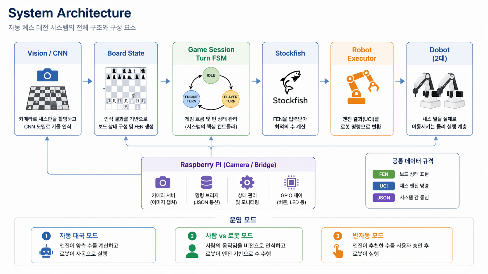
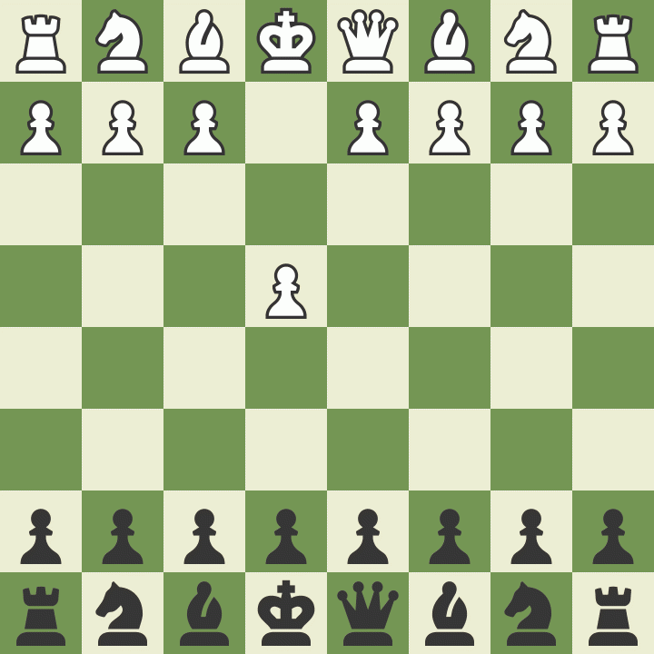

# Dobot Chess: 듀얼 로봇 통합 체스 시스템
**두 대의 도봇(Dobot)과 AI 비전 기술을 결합한 자동 체스 대국 및 분석 시스템**  

## 목차
* [1.프로젝트 개요](#1프로젝트-개요-overview)
* [2.목표](#2목표-goals)
* [3.개발 일정](#3개발-일정-development-timeline)
* [4.시스템 아키텍쳐](#4시스템-아키텍쳐-sytem-architecture)
* [5.주요 기능](#5주요-기능-core-features)
* [6.기술 스텍](#6기술-스텍-technical-stack)
* [7.환경 설정 및 설치](#7환경설정-및-설치)
* [8.시연](#8-시연-demo)
* [9.실행 방법](#9실행-방법-deployment)
* [10.팀원 및 역할](#10팀원-및-역할-tasks)
* [11.트러블 슈팅](#11트러블슈팅-trouble-shooting)

## 1.프로젝트 개요 (Overview)
또봇 2대를 체스판 양측에 배치하여 중앙 제어 소프트웨어가 게임 상태를 판단하고, 각 로봇에 이동 명령을 전달하여 실제 체스 대국을 수행하는 시스템입니다.
* **AI 대국**: Stockfish 엔진 기반의 자동 수 계산 및 물리적 이동
* **비전 인식**: 카메라를 통한 실시간 보드 상태 인식 및 FEN 데이터 변환
* **통합 제어**: 하나의 통합 시스템으로 서로 다른 이벤트 루프를 가진 프로세스들을 안전하게 관리    

## 2.목표 (Goals)
* **자동 체스 대국 시스템**: AI 엔진을 활용해 스스로 수를 두고 실제 말을 옮기는 시스템 구축.
* **정밀한 물리적 구현**: 듀얼 로봇 제어를 통해 체스 말의 정확한 이동 및 배치 구현.
* **실시간 상태 모니터링**: 게임 진행 상황을 UI로 시각화하고 로그를 통해 관리.
* **성공적인 시연**: 발표 현장에서 오류 없이 동작하는 통합 프로토타입 완성.  

## 3.개발 일정 (Development Timeline)
1. **Phase 1** : Analysis & Design (d1~2)  
    * 요구사항 정리  
    * 아키텍처 설계
1. **Phase 2** : Core System (d3~4)  
    * 체스 로직 구현
    * 엔진/수 계산 연동
1. **Phase 3** : Hardware Integration (d5~7)    
    * 또봇 제어 / Pi 브리지  
    * 좌표 보정 / 통합 연결
1. **Phase 4** : Test & Presentation (d8~9)
    * 오류 수정 / 리허설
    * 최종 발표 준비
  
## 4.시스템 아키텍쳐 (Sytem Architecture)
<!--  -->
  

## 5.주요 기능 (Core Features)
* **통합 런처**: Streamlit(분석기), Tkinter(로봇 GUI), FastAPI(서버)를 개별 프로세스로 실행하여 안전성 확보.
* **비전 서버**: Raspberry Pi 기반의 전용 서버로 실시간 카메라 데이터 공유. 
* **멀티 모드**: 사람 vs AI, AI vs AI 등 다양한 대국 모드 지원.
* **로그 및 복구**: 게임 로그 관리 및 시스템 오류 시 상태 복구 기능.

## 6.기술 스텍 (Technical Stack)
1. **Language** 
    * Python 3.x
1. **Vision/AI**
    * OpenCV, CNN 기물 인식,
    * Stockfish Engine
1. **Frameworks**
    * FastAPI (Bridge)
    * Streamlit (Analysis)
    * Tkinter (GUI)
1. **Hardware** 
    * Raspberry Pi
    * Dobot Magician

## 7.환경설정 및 설치
```bash
#저장소 복제
git clone https://github.com/seonghoe5697/chess_robot.git
cd chess_robot

# 가상환경 생성 및 활성화
python3 -m venv venv
source venv/bin/activate

# 의존성 설치 (각 모듈별 설치 권장)
pip install -r requirements.txt  
```
## 8 시연 (Demo)
<table border="0">
  <tr>
    <td width="50%" align="center">
      
      <br> <b>GUI</b>
    </td>
    <td width="50%" align="center">
      
      </img>
      <br> <b>실제 동작</b>
    </td>
  </tr>
</table>

## 9.실행 방법 (Deployment)  
**실행 순서** : Pi 브릿지 서버 → SW 분석기 → HW 도봇 GUI  

***라즈베리파이(비젼 서버) 활성화***  
터미널에서 다음 명령을 실행  
```bash
cd Documents/chess_robot/raspi_team  
source ../venv/bin/activate
python server.py
        # or
uvicorn server:app --host 0.0.0.0 --port 8000 --reload
```
***1.브라우저에서 (서버) 확인***
```bash
http://192.168.0.133:8000/
```
***2.통합 런처 활성화***
```bash
cd ~/integrated_chess_project
python main_launcher.py
```
***3.PI 카메라 서버 연결상태 확인***  
***4.SW 분석기 활성화 후 프로그램 테스트***
## 10.팀원 및 역할 (Tasks)
| 팀원 | 역할 | 담당 업무 |
|:---:|:---:|:---:|  
| 김효성 | PM /  통합 | 요구사항 조율,일정 관리,문서 발표 자료,통합 총괄
| 김상윤 | 체스 로직 / 엔진 | 규칙 처리,보드 상태,수 계산 흐름 구현
| 이승재 | 연결 / 테스트 | 시뮬레이션 검증,통합 테스트
| 구형진 | 로봇 제어 | 로봇 제어 인터페이스,좌표변환,통신,UI엔진 연결
| 최성회 | Raspberry PI | 서버구축,비전통합,브리지 상태 회신

## 11.트러블슈팅 (Trouble Shooting)
* 이벤트 루프 충돌: Streamlit, Tkinter, FastAPI가 공존하지 못하는 문제를 subprocess 방식의 통합 런처로 해결.  
* 정밀도 문제: 로봇 좌표 오차와 비전 인식 오차를 보정하기 위한 캘리브레이션 단계 추가.  
* 통신 지연: HTTP JSON 인터페이스를 통해 모듈 간 데이터 동기화 최적화.